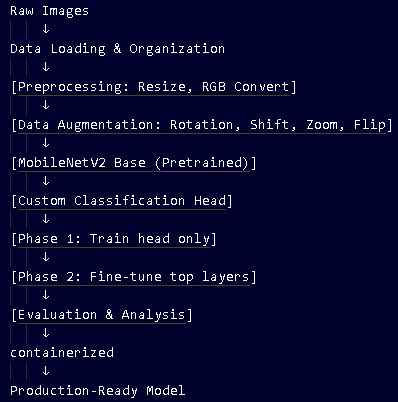

# **Smart Fashion Classifier Version 2.0 With Streamlit UI**

## **Project Overview**

The **Smart Fashion Classifier** is a deep learning-based solution designed to automate the categorization of fashion products from images. Using the **Fashion Product Images (Small)** dataset from Kaggle, the project implements a robust end-to-end pipeline—from model training with transfer learning to containerized microservices deployment.

### **Complete Pipeline Architecture**



### **Problem Statement**

In the fast-paced e-commerce industry, manually tagging thousands of new fashion items with correct categories (e.g., "Shirts", "Watches", "Casual Shoes") is time-consuming, prone to human error, and expensive to scale.

**Solution:** This project addresses the bottleneck by using a Convolutional Neural Network (CNN) to automatically predict product categories. By integrating this model into a scalable microservice architecture, businesses can provide instant search results, improve inventory management, and enhance the customer experience through automated tagging.

### **Target Users & Interaction**

* **Retailers & Inventory Managers:** Can upload bulk images to a backend system that automatically classifies products for database entry.
* **Mobile App Developers:** Can integrate the prediction API to allow users to take a photo of an item and find similar products or automatic tags.
* **Creative Edge:** Unlike static classifiers, this solution uses a **Gateway-Serving architecture**. It separates image preprocessing (Gateway) from model inference (TF-Serving), allowing each component to scale independently in a production environment like Kubernetes.

---

## **Technical Architecture**

The project follows a microservices pattern:

1. **Gateway Service:** A Flask-based API that handles image fetching from URLs, preprocessing (resizing to 299x299), and converting data into gRPC requests.
2. **Model Service (TF-Serving):** A high-performance serving system that hosts the trained Xception model and handles inference via gRPC.

### **Machine Learning Details**

* **Model:** **Xception** (pre-trained on ImageNet) utilized via transfer learning.

* **Preprocessing:** Images are resized to  and normalized to a range of [-1, 1].
* **Classification:** The model classifies items into 15 top fashion categories, including T-shirts, Watches, Casual Shoes, and Handbags.

* **Training:** Implemented in Jupyter Notebook with data augmentation, stratification, and evaluation metrics (confusion matrix, classification report).

---

## **File Structure Reference**

| File Name                                                     | Description                                                       |
| --------------------------------------------------------------|-------------------------------------------------------------------|
| [notebook](notebooks/notebook.ipynb)                          | Training pipeline: EDA, Transfer Learning, and Model Export.      |
| [gateway.py](gateway.py)                                      | Flask API for handling user requests and gRPC communication.      |
| [proto.py](proto.py)                                          | Helper script to convert NumPy arrays to Protobuf format for gRPC.|
| [image-model.dockerfile](image-model.dockerfile)              | Docker config for the TensorFlow Serving inference service.       |
| [image-gateway.dockerfile](image-gateway.dockerfile)          | Docker config for the Flask-based Gateway service.                |
| [docker-compose.yaml](docker-compose.yaml)                    | Orchestrates both services for local testing.                     |
| [gateway-deployment.yaml](kube-config\gateway-deployment.yaml)| Kubernetes Deployment for gateway.                                |
| [gateway-service.yaml](kube-config/model-service.yaml)        | Kubernetes Service configuration for gateway.                     |
| [model-deployment.yaml](kube-config/model-deployment.yaml)    | Kubernetes Deployment for model.                                  |
| [model-service.yaml](kube-config/model-service.yaml)          | Kubernetes Service configuration for model.                       |
| [Pipfile](Pipfile)                                            | Python dependency management.                                     |
| [Pipfile.lock](Pipfile.lock)                                  | Python dependency management.                                     |
| [test.py](test.py)                                            | Script to test the prediction endpoint.                           |
| [demo_video.webm](demo_video.webm)                            | Demo Video of the application.                                    |
| [image-frontend.dockerfile](image-frontend.dockerfile)        | To containerize the UI.                                           |
| [cloud-deployment-guide](cloud-deployment-guide.md)           | Comprehensive guide for deploying to AWS EKS.                     |
| [streamlit-deployment-guide](streamlit-deployment-guide.md)   | Comprehensive guide for deploying to Streamlit Cloud.             |
| [testing-guide](testing-guide.md)                             | Covering local Kubernetes (Kind) and port-forwarding.             |
---

## **Getting Started**

### 1. Install Dependencies

This project uses `pipenv` for environment management.

```bash
# Install pipenv if you haven't
pip install pipenv

# Activate shell
pipenv shell

# Install project dependencies
pipenv install --deploy --system

# Install a new package
pipenv install <package-name>
```

### 2. Local Execution (Docker Compose)

The easiest way to run the project is using Docker Compose:

```bash
docker-compose up --build
```

* The **Gateway** will be available at `http://localhost:9696`.
* The **TF-Serving** internal gRPC port is `8500`.

### 3. Test the Service

Run the provided test script [test.py](test.py) to classify a sample image:

```bash
python test.py
```

---

## **Deployment to AWS EKS**

To deploy your Smart Fashion Classifier to AWS EKS, follow this concise step-by-step guide.

### 1. Create the EKS Cluster

Create a file named `eks-config.yaml` to define your infrastructure.

```yaml
apiVersion: eksctl.io/v1alpha5
kind: ClusterConfig
metadata:
  name: smart-fashion-classifier-eks
  region: eu-west-1
nodeGroups:
  - name: ng-m5-xlarge
    instanceType: m5.xlarge
    desiredCapacity: 1
```

Run the following command to provision the cluster (this takes 15–20 minutes):

```bash
eksctl create cluster -f eks-config.yaml
```

### 2. Push Images to AWS ECR

You must host your Docker images in AWS ECR so EKS can pull them.

1. **Create Repository:** Create a repository (e.g., `fashion-images`) in the AWS Console.
2. **Authenticate:** Run the `aws ecr get-login-password` command provided by the AWS Console.
3. **Tag and Push:**

```bash
# Replace <ACCOUNT_ID> with your AWS ID
PREFIX=<ACCOUNT_ID>.dkr.ecr.eu-west-1.amazonaws.com/fashion-images

docker tag fashion-model:latest ${PREFIX}:fashion-model-v1
docker tag fashion-gateway:latest ${PREFIX}:fashion-gateway-v1

docker push ${PREFIX}:fashion-model-v1
docker push ${PREFIX}:fashion-gateway-v1
```

### 3. Update Kubernetes Manifests

Open `gateway-deployment.yaml` and your model deployment file. Update the `image` field to use the ECR URIs created in the previous step.

**Example snippet in `gateway-deployment.yaml`:**

```yaml
spec:
  containers:
  - name: gateway
    image: <ACCOUNT_ID>.dkr.ecr.eu-west-1.amazonaws.com/fashion-images:fashion-gateway-v1
```

### 4. Deploy to the Cluster

Apply the configurations in order. The model must be deployed first so the gateway can connect to it.

```bash
# Deploy Model Service
kubectl apply -f model-deployment.yaml
kubectl apply -f model-service.yaml

# Deploy Gateway Service
kubectl apply -f gateway-deployment.yaml
kubectl apply -f gateway-service.yaml
```

### 5. Verify and Test

Check the status of your pods and find the external LoadBalancer URL:

```bash
kubectl get pods
kubectl get service gateway
```

* **External URL:** Copy the `EXTERNAL-IP` from the gateway service output.
* **Update `test.py`:** Replace `localhost:9696` with the External IP.
* **Run Test:** `python test.py`

### 6. Cleanup

To avoid ongoing AWS charges for the EC2 instances and LoadBalancer, delete the cluster when finished:

```bash
eksctl delete cluster --name smart-fashion-classifier-eks
```

1. **Service Discovery:**
The Gateway service is configured to find the model service via its internal DNS: `tf-serving-model.default.svc.cluster.local:8500`.
2. **Accessing the App:**
Expose the Gateway via a LoadBalancer or Ingress to receive external traffic on port `9696`.

## **What's New in Version 2.0: Interactive Streamlit UI**

I have upgraded the project from a raw API to a full-stack ML application with a user-friendly interface.

### **Interactive Streamlit Frontend**
The new frontend [streamlit-frontend](streamlit-frontend/app.py) allows non-technical users to interact with the model seamlessly.

*   **Image Upload & URL Support:** users can upload local files or paste image URLs.
*   **Visual Confidence Scores:** A bar chart visualizes the predicted categories and their confidence levels.
*   **Decoupled Architecture:** The frontend is a separate microservice (`fashion-frontend`) that communicates with the API Gateway via REST/HTTP.

### **Demo Recording**

[Demo Video](demo_video.webm)

### **Deployment Updates**
*   **Frontend Docker Image:** Created [image-frontend.dockerfile](image-frontend.dockerfile) to containerize the UI.
*   **Cloud Guides:** Added comprehensive documentation for deploying to **AWS EKS** [cloud-deployment-guide](cloud-deployment-guide.md) and **Streamlit Cloud** [streamlit-deployment-guide](streamlit-deployment-guide.md)
*   **Testing:** New [testing-guide](testing-guide.md) covering local Kubernetes (Kind) and port-forwarding.

## **Future Roadmap**

*   **CI/CD Pipeline:** Automate the build and push process using GitHub Actions.
*   **Model Monitoring:** Integrate Prometheus/Grafana to track prediction latency and drift.
*   **HTTPS/SSL:** Secure the Gateway with TLS certificates for production use.
